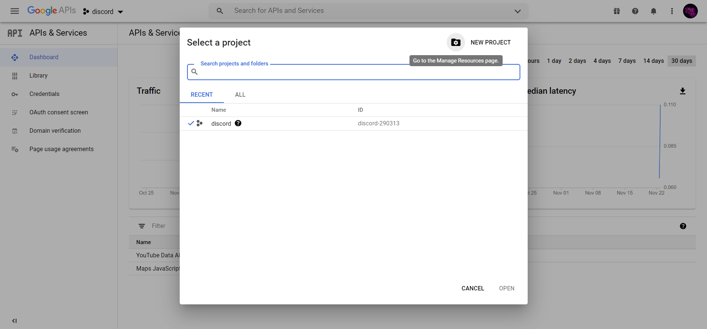
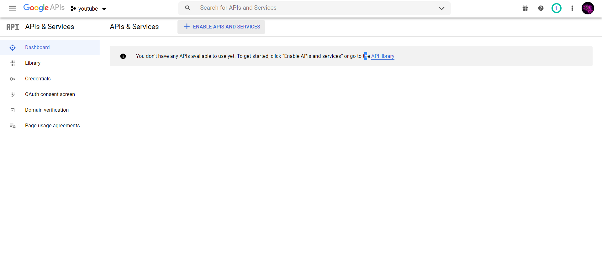
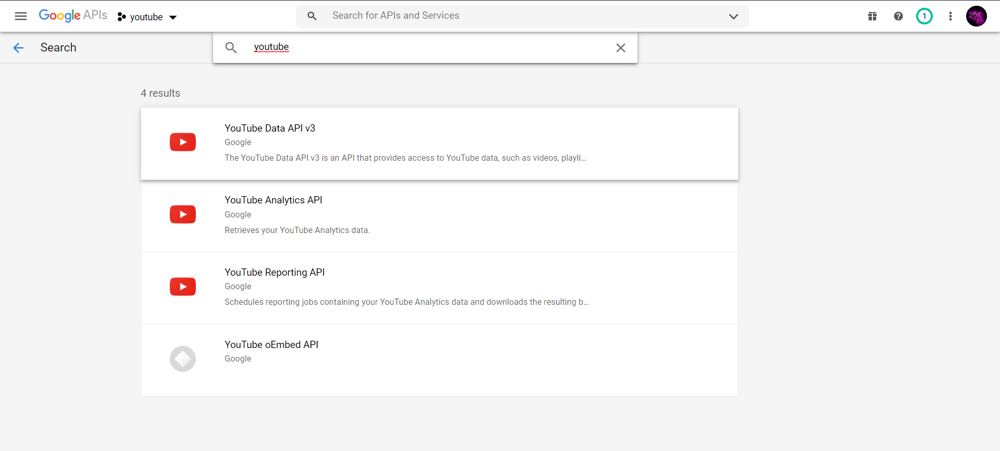
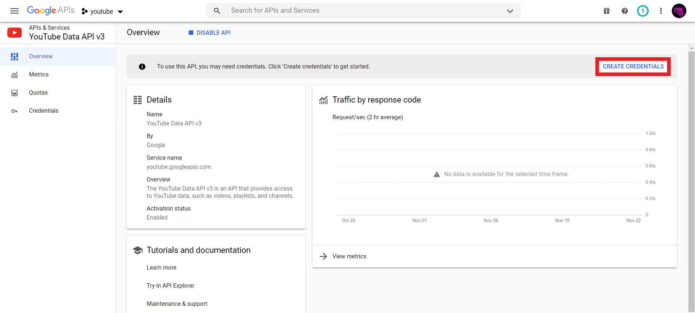
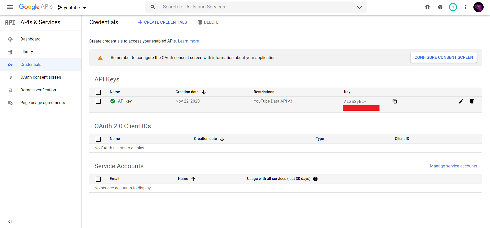

## How to create youtube API key

### URL
`https://console.developers.google.com/`

### Create project

### Set name

### Click on enable API

### Enable Youtube v3 API

### Create credentials

### Copy API key

