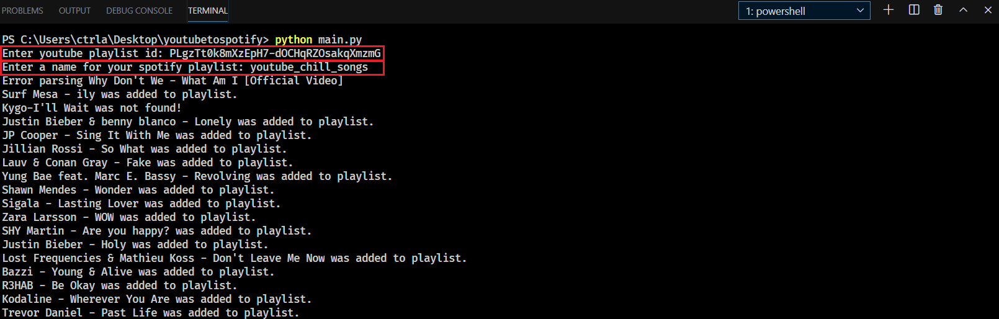
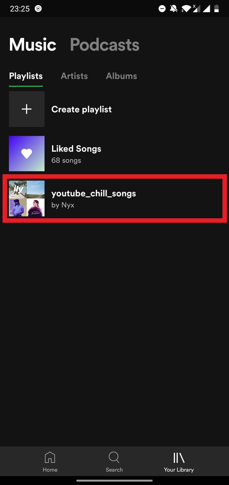
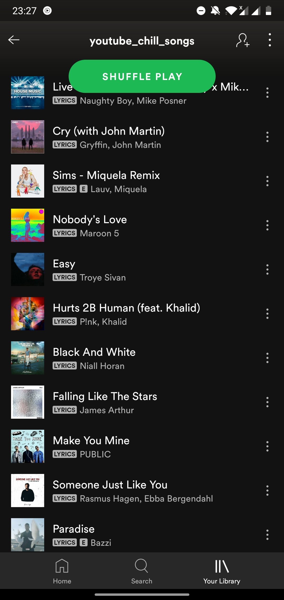

# youtubetospotify
A simple script to add all songs from youtube playlist to spotify playlist.

## What's different in version 2?
```
Faster: Uses Youtube API to get song info instead of selenium.
Convenient: No need to refresh token after every hour.
Reliable: Adds 85-95% of the songs from popular youtube playlists.
```

## Note
`Works only for public youtube playlists.`

## Stats
`Added 142 songs to spotify playlist out of 150 songs from youtube playlist`

## Setup
1.Create an app: https://developer.spotify.com/dashboard/applications


2.Copy the Client id and client secret


3.Set redirect uri to http://localhost:8888/callback


### Get youtube API key  
[CLICK HERE TO SEE HOW TO CREATE YOUTUBE API KEY](GET_KEY.md)

### Setting Environment Variables (Windows)
```
set SPOTIFY_USER_ID <your_user_id>  
set SPOTIFY_CLIENT_ID <your_client_id>  
set SPOTIFY_CLIENT_SECRET <your_client_secret>  
set SPOTIFY_REDIRECT_URI 'http://localhost:8888/callback'  
set YOUTUBE_API_KEY <your_youtube_api_key> 
```

## Usage

`python main.py`


## Output
```
Enter youtube playlist id: PLgzTt0k8mXzEpH7-dOCHqRZOsakqXmzmG
Enter a name for your spotify playlist: youtube_chill_songs   

The Chainsmokers - Takeaway was added to playlist.
KIRBY-Don't Leave Your Girl was not found!
Lauv - There's No Way was added to playlist.
.
.
.
Usher - Crash was added to playlist.
```

## Example



## Result
 


