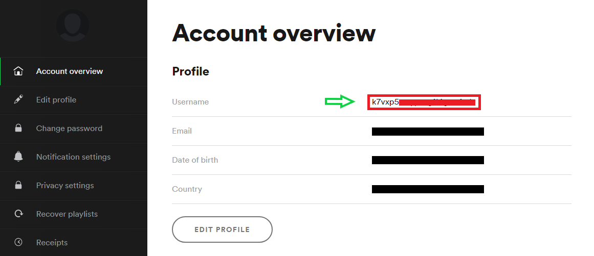
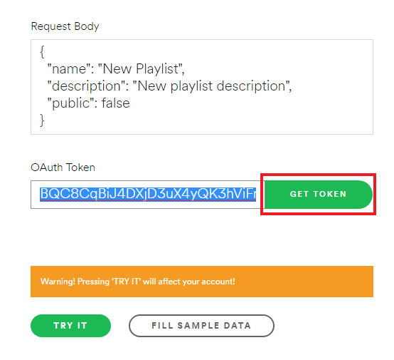
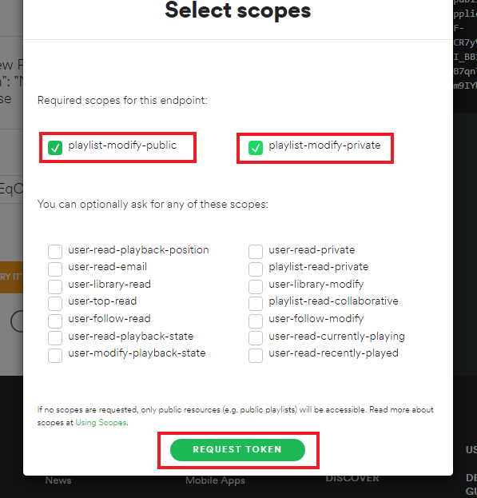
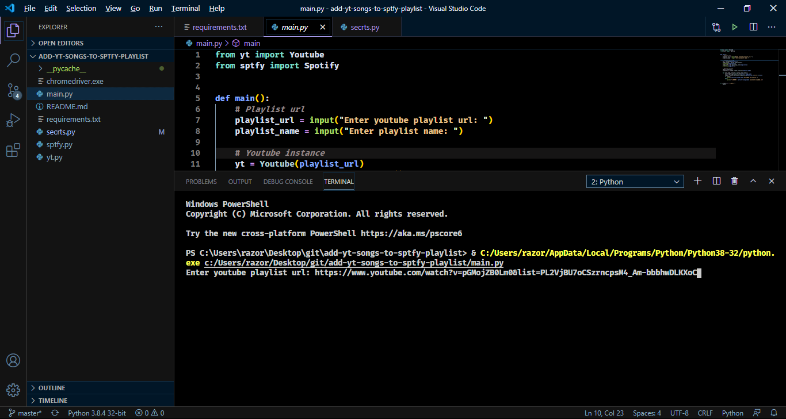
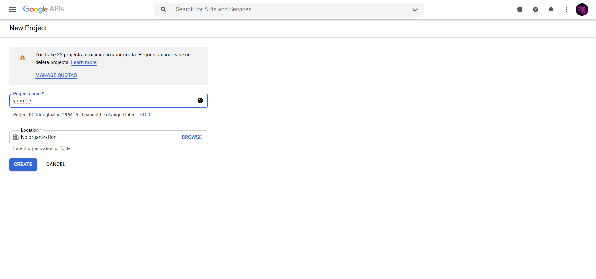
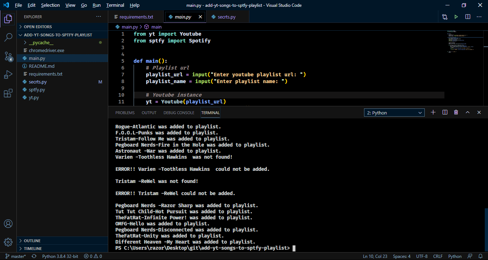
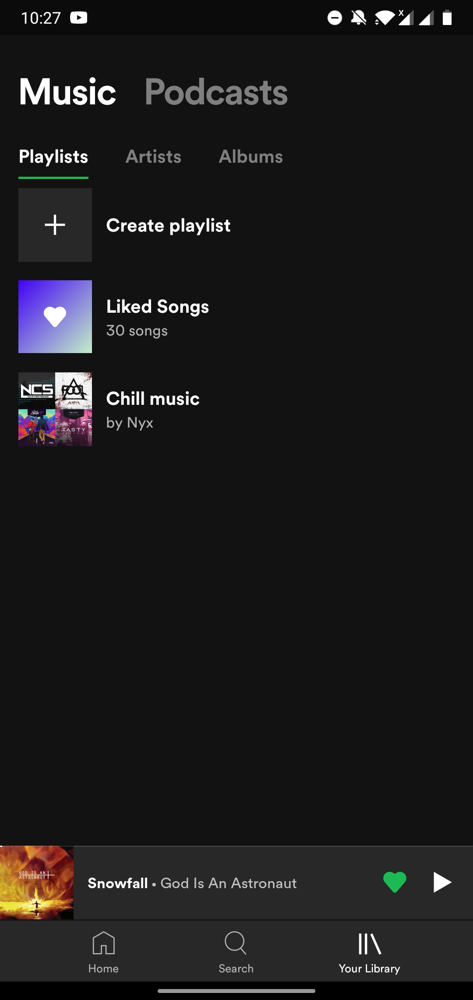
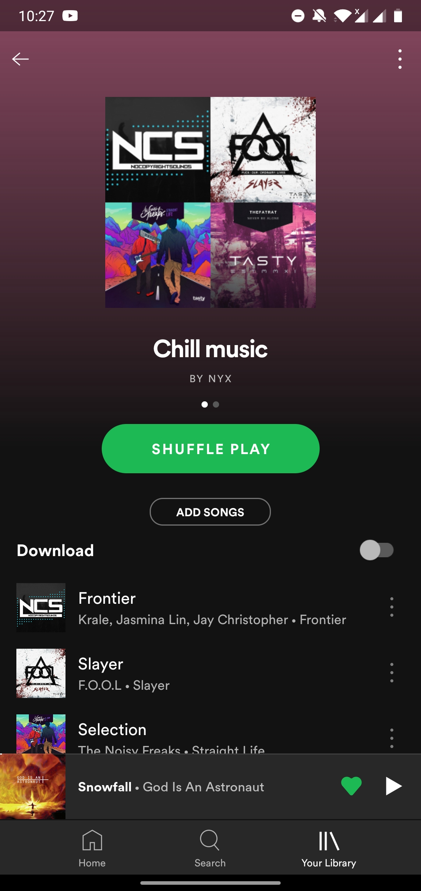

# add-yt-songs-to-sptfy-playlist

## Setup
1. Download chromedriver (https://chromedriver.chromium.org/downloads)  
Note: Download the same version as your chrome browser..  
      Do not install it, just place the chromedriver.exe in the same folder as the project itself.

2. Copy your spotify user_id/username. (https://www.spotify.com/in/account/overview/)  

3. Get spotify token from this website and copy it. (https://developer.spotify.com/console/post-playlists/)  
Note: The token expires in one hour. So go to the above website and get the token refreshed when needed.  

  

  

4. Paste the username and spotify token in secrts.py file.  

## How To Run
1. Run main.py file.  
2. Enter the youtube playlist url.  
3. Enter what you want the playlist to be named.  

That's it.  

## Screenshots  

  
  
  

 

